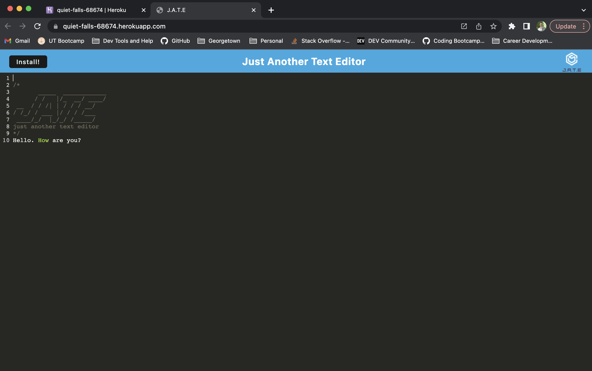

# Text-Editor

## Description

For this challenge assignment I was tasked with creating a text editor that functions in a web browser. The text editor saves inputs from the user in the browser cache so you can see the previous additions and edits made to the editor. There is an install function where you can add the text editor as an App on your web browser. I deployed the text editor to Heroku where the text editor can be used in browser. 

## Screenshot

## Link to deployed application

https://quiet-falls-68674.herokuapp.com/

